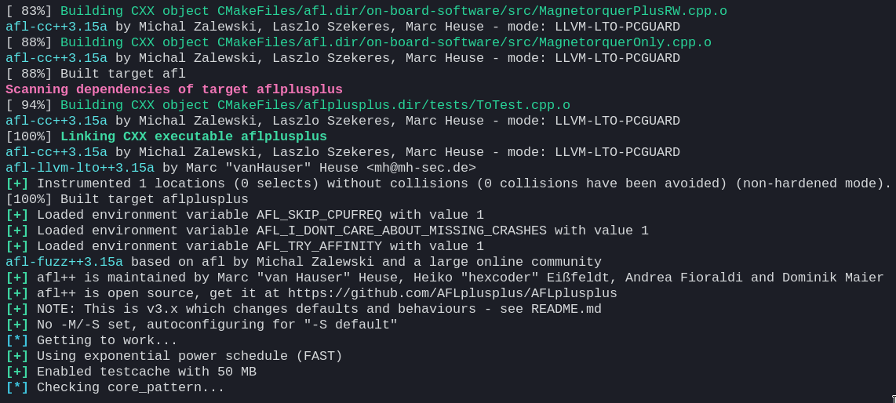
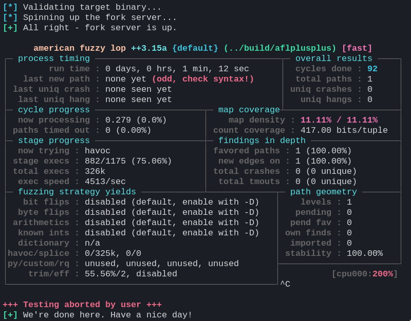

<details>
<summary>Click to expand</summary>

- [TL;DR](#tldr)
- [Installing/Building](#installingbuilding)
  - [Packages](#packages)
  - [Docker](#docker)
    - [Arch Linux](#arch-linux)
    - [get-docker](#get-docker)
    - [Development](#development)
  - [Manual](#manual)
- [Fuzzing](#fuzzing)
  - [Risks](#risks)
  - [Introduction](#introduction)
- [Using](#using)
- [Gallery](#gallery)

</details>

This is a collection with some, documented, basic utility shell scripts to help automate part of the process of fuzzing a target executionable using [AFL++](https://github.com/AFLplusplus/AFLplusplus), [AFL](https://lcamtuf.coredump.cx/afl/) on steroids. If you're a beginner, there's not a lot of easy-to-digest resources on how to fuzz with afl/afl++. I hope this can give you a good starting point. Note that the scripts here are pieced together in a somewhat hacky way, and there's a lot of potential improvements (contributions welcome!). Also note that this only covers the most basic functionality of afl++, then you're on your own. There are some pointers on what can be improved over at the [issues tab](https://github.com/xlxs4/aflplusplus-util/issues).

Make sure that you understand how fuzzing (with afl++) works before treading further. The [afl++ README](https://github.com/AFLplusplus/AFLplusplus/blob/stable/docs/README.md) can serve as a good starting point.

To use this, you'll have to change and add the `CMakeLists.txt` to the one you already have, as well as modify the exclusion pattern inside `/scripts/_cov.sh`. After you get the building/instrumentation to work, you can start adding stuff in `tests/` and `inputs/`.

A more experienced Linux user will get suspicious of `--security-opt seccomp=unconfined`. See [this](https://github.com/AFLplusplus/AFLplusplus/blob/stable/docs/fuzzing_in_depth.md#a-running-afl-fuzz), [this](https://github.com/AFLplusplus/AFLplusplus/blob/stable/afl-system-config#L55) and the `setup.sh` script residing in `aflplusplus/scripts/`. Same goes for `afl-system-config`.

### TL;DR

[](https://asciinema.org/a/457900)

1. `cd aflplusplus-util/statsd`
2. `docker-compose up -d` Starts Prometheus, `statsd-exporter` and Grafana in the same network
3. browse `localhost:3000` (Grafana login page)
4. login with username: `admin`, password: `admin`
5. Set up a password for `admin`
6. Go to `Create` -> `Import` -> `Upload JSON file` and select `statsd/grafana-afl++.json`
7. In new terminal/pane: `sudo docker pull aflplusplus/aflplusplus`
8. `curl -LJO https://raw.githubusercontent.com/AFLplusplus/AFLplusplus/stable/afl-system-config`
9. `chmod +x afl-system-config`
10. `sudo ./afl-system-config` (re-run after system has rebooted between sessions)
11. `sudo docker run -ti --security-opt seccomp=unconfined -v $PWD/aflplusplus-util:/aflplusplus-util aflplusplus/aflplusplus` (run from the parent dir of `aflplusplus-util`, or change the `$PWD/aflplusplus-util` part)
12. `cd ../aflplusplus-util`
13. `. ./scripts/setup.sh`
14. `./scripts/instrument.sh`
15. `./scripts/build-cov.sh`
16. `./scripts/launch-screen.sh`
17. `./scripts/tmin.sh`
18. `./scripts/fuzz.sh`
19. `./scripts/cov.sh`
20. `./scripts/stop-fuzz.sh`
21. `./scripts/cmin.sh`
22. `./scripts/retmin.sh`
23. `./scripts/refuzz.sh`
24. Repeat 19-23 (`cov` - `refuzz`)
25. `./scripts/triage.sh`
26. `./scripts/quit-screen.sh`
27. `docker-compose down` when you're done with StatsD/Prometheus/Grafana

A `tldr` alias is defined through `setup.sh` so that you can get a quick overview of the script execution order.

### Installing/Building

#### Packages

Check your (favorite) package repository. It is _very_ likely that AFL++ is already packaged for your distribution, if you want to go down that road.

#### Docker

As per the [AFLPlusPlus README](https://github.com/AFLplusplus/AFLplusplus/blob/stable/docs/INSTALL.md), using Docker to grab AFL++ is highly recommended. Not only is it easy to get up and running, but, more importantly, it ensures you have recent GCC and CLang versions. It is recommended to use as bleeding edge `gcc`, `clang` and `llvm-dev` versions as you can get in your distro. Note that AFL++ comes with many different modes and glitter, so, provided you want to be fancy, using docker also saves you from going out in the wild and gathering the dependencies needed. Going on a tangent, Going on a tangent, check [this](https://github.com/AFLplusplus/AFLplusplus/blob/stable/instrumentation/README.lto.md) for an example. You can use `afl-clang-lto` for instrumentation purposes, which we do here. If you click on the link, you'll understand that using `afl-clang-lto` is vastly better to any other option for a shitton of reasons. Well, it requires llvm 11+

In the official afl++ repository, using Docker was recommended but now this recommendation is removed. In fact, they recommend [compiling and building everything you need on your own](https://github.com/AFLplusplus/AFLplusplus/blob/stable/README.md#building-and-installing-afl). I still think that it will be easier for the people to work on the nanosatellite codebase to just grab the big image and be done for. Imagine having to gather all these bleeding-edge version dependencies on Ubuntu :stuck_out_tongue:

That being said, the [`Dockerfile`](https://github.com/AFLplusplus/AFLplusplus/blob/stable/Dockerfile) could see some improvements (mainly to reduce size). Plus, there's stuff in the final image we don't need. I plan on using Docker for a lot of AFL++-related things. So, TL;DR, when I do this, I'll roll my own image fit for our own usecase and it should be noticeably smaller (though probably still not *small*). The `Dockerfile` will reside in [`CI Tool Recipes`](https://gitlab.com/acubesat/obc/ci-tool-recipes), meaning that it will be built from a standard, traceable [`base`](https://gitlab.com/acubesat/obc/ci-tool-recipes/-/blob/master/base/Dockerfile), with the same base dependencies everywhere, will be published under the `spacedot` namespace on Docker Hub and be kept up to date (dependency-wise) along with the rest of the toolbase. 

##### Arch Linux
```sh
sudo pacman -Syu docker && sudo systemctl start docker && sudo systemctl enable docker
```

##### get-docker

For distros such as:
- ubuntu
- debian
- raspbian
- centos
- rhel
- sles

You can use the [`get-docker.sh` shellscript](https://github.com/docker/docker-install), provided and maintained by Docker:
```sh
curl -fsSL https://get.docker.com -o get-docker.sh
sh get-docker.sh

# To verify that the install script works across the supported OSes:
make shellcheck
```

If you prefer to build the image locally, you can find their `Dockerfile` [here](https://github.com/AFLplusplus/AFLplusplus/blob/stable/Dockerfile).

You might have to run docker with root privileges. If you want to run it as a non-root user, you usually have to add your user in the `docker` group. Beware, since adding a user to the `docker` group is equivalent to giving root access, since they will be able to start containers with root privileges with `docker run --privileged`. From the [Docker entry](https://wiki.archlinux.org/title/docker) on the Arch Linux wiki:
> If you want to be able to run the docker CLI command as a non-root user, add your user to the docker user group, re-login, and restart docker.service.

> Warning: Anyone added to the docker group is root equivalent because they can use the docker run --privileged command to start containers with root privileges. For more information see [3](https://github.com/docker/docker/issues/9976) and [4](https://docs.docker.com/engine/security/).

Note that to be able to [set up](https://github.com/AFLplusplus/AFLplusplus/blob/stable/docs/rpc_statsd.md#installing-and-setting-up-statsd-prometheus-and-grafana) the StatsD, Prometheus and Grafana infrastracture, if you want to be able to use the `docker-compose.yml` configuration provided in `statsd/`, you have to have the `docker-compose` binary. If you didn't use the `get-docker.sh` script to install Docker, you might have to install the binary separately, using your distributions' package manager (e.g., in arch it's `sudo pacman -S docker-compose`). Alternatively, you can run `docker compose up` instead of `docker-compose up -d`, as seen in the Docker [documentation page](https://docs.docker.com/compose/).

If you get a `unknown option --dport` `iptables` error, that might mean you have to install `iptables-nft` instead of `iptables` (legacy). Make sure to reboot afterwards.

##### Development

After getting docker up and running, you can just pull the AFL++ image:
```sh
sudo docker pull aflplusplus/aflplusplus
```

You can then start the AFL++ container. It would be convenient if you could transfer (mount) the project file somewhere on the container, so that you don't have to copy the files over, or `git clone` again from inside the container. You can do that with [docker volumes](https://docs.docker.com/storage/volumes/#start-a-container-with-a-volume). For example, if you were on the parent directory of `aflplusplus-util` (otherwise, change the `$PWD/aflplusplus-util` part), you would run:
```sh
sudo docker run -ti --security-opt seccomp=unconfined -v $PWD/aflplusplus-util:/aflplusplus-util aflplusplus/aflplusplus
```
and you can access the project structure with `cd ../aflplusplus-util`. Note that we use `$PWD` because docker wants you to use an absolute path when passing a host directory.

Just for the sake of completeness, the full process to grab the repository and play around with afl would be something like:
```sh
git clone https://github.com/xlxs4/aflplusplus-util.git
sudo docker run -ti --security-opt seccomp=unconfined -v $PWD/aflplusplus-util:/aflplusplus-util aflplusplus/aflplusplus
cd ../aflplusplus-util
```

<p float="left">
  
   
</p>

Fun fact: Since you mounted the volume, any changes you do in `aflplusplus-util` while inside the container will persist in the host directory even after closing the container. This is bidirectional: you can keep updating the `aflplusplus-util` directory from outside, and the changes will be immediately reflected inside the container
Fun fact #2: you can work inside the container, and sign your commits with `git commit -S` out of the box!

If you want to be able to work with the `aflplusplus-util` repository with `git` from inside the running `aflplusplus` mounted container, first run `git config --global --add safe.directory /aflplusplus-util` (as prompted).

#### Manual

If you want to build what you need yourself, you have to gather any dependencies you might want (e.g. flex, bison, llvm) beforehand. After you have everything at your disposal, you can follow the standard building routine:
```sh
git clone https://github.com/AFLplusplus/AFLplusplus
cd AFLplusplus
make distrib
sudo make install
```

Note that the `distrib` build target will get you AFL++ with all batteries included. For other build targets and build options you can refer to the [README](https://github.com/AFLplusplus/AFLplusplus/blob/stable/docs/INSTALL.md#linux-on-x86).

### Fuzzing

#### Risks

Before going on, spend some time to read on [what can go wrong](https://github.com/AFLplusplus/AFLplusplus/blob/stable/docs/fuzzing_in_depth.md#0-common-sense-risks).

#### Introduction

<details>
<summary>Click to expand</summary>

**Fuzzing**, or fuzz testing, is a testing approach where the input is generated from the tester and passed into the program, to get a crash, a hang, a memory leak, and so on and so forth. The key ability of a good fuzzer software is its ability to adapt the generated input, based on how the codebase that is being fuzzed responds to all previous input. The input passed must be valid input, i.e. accepted by the parser. Fuzzing does not only serve as a tool to explore potentially faulty/insecure areas of the codebase, but also ends up providing the user with a good testing corpus to base other, more traditional, testing approaches like unit testing on.

Fuzzing happens in cycles. Repeat after me: cycles are the bread and butter of fuzzing. The user need only provide the initial testing corpus; then, the machine takes over. For some quick visual understanding of the fuzzing process (implemented here) at a high level, you can refer to the flowgraph below (TODO). 

The fuzzer used is [AFL++](https://aflplus.plus/), a community-led supercharged, batteries-included version of [afl](https://lcamtuf.coredump.cx/afl/).

First, the user must specify the initial input. This is an important step, since you want the initial input to be both as concise but also as complete as possible. By the input being complete, I mean including a variety of inputs that each propagates to a different part of the codebase and, ideally, evokes a different response; with the goal being covering the whole codebase. By the input being concise, I mean that the existence of each single input entry must be justified. Each must be different than the rest, bringing something different and important (i.e. a different execution branch(es)) into the table. The initial input can be found inside the `inputs/` directory.

Since fuzzing is based on cycling, it is an iterative process at heart. This constant iteration allows for the input to also improve, based on the fuzzing results. There are two main utilities that come into play here, `cmin` and `tmin`. [`afl-cmin`](https://github.com/AFLplusplus/AFLplusplus/blob/stable/afl-cmin) is used to minimize the input corpus while maintaining the same fuzzing results (i.e. making the input more concise). This script essentially goes over each identical result and selects the shortest input that led to this result. `afl-tmin` does something different: It doesn't select the shortest entries; instead, it shortens the entries you feed to it. The gist is the following: For each entry, it gradually removes data while ensuring that the initially observed behavior remains the same. `cmin` and `tmin` can be, and should be, run more than once. The process thus constitutes a neverending back and forth of fuzzing, collecting the observed execution behavior, minimizing the input cases generated by the fuzzer(s) with `cmin`, then trimming them further with `tmin`, then passing the shortened and improved input as initial input and starting the fuzzing process anew.


For more info, go over the [docs/](https://github.com/AFLplusplus/AFLplusplus/tree/stable/docs) in AFL++'s repository, read the rest of the README, and the documentation in each script in the `aflplusplus` folder.

For even more info, I suggest first going over the original AFL whitepaper, found [here](https://lcamtuf.coredump.cx/afl/technical_details.txt), and then the AFL++ publication, found [here](https://aflplus.plus/papers/aflpp-woot2020.pdf). [^1]

[^1]: Fioraldi, A., Maier, D., Eißfeldt, H., & Heuse, M. (2020). {AFL++}: Combining Incremental Steps of Fuzzing Research. In 14th USENIX Workshop on Offensive Technologies (WOOT 20).

</details>

### Using

Assuming you can use `afl-clang-lto` and the like, and that you are inside `aflplusplus/`, you can simply:
1. `. ./scripts/setup.sh`
   
   Note that this script was made to be ran inside the `aflplusplus/aflplusplus` image Docker container, as demonstrated above. For other distros and/or environments, you might have to inspect the script and tailor all steps to your own box accordingly. It can still serve as a good guideline on what you need to set up.

   After executing this script it would be a good idea to either `source ~/.bashrc` or restart your terminal, so that the env changes caused by the script execution are reflected in your terminal session. Even better, you can just `source ./scripts/setup.sh` or, for a shortcut, `. ./scripts/setup.sh`. This ensures every env change is automatically passed to your terminal session.
   
   This makes sure you can run `screen`, `rsync`, `gdb` and `go`. `screen` is used to start detached sessions to run time-consuming commands that should not be aborted midway. `rsync` is used to copy files instead of `cp` to allow for overwrites. `gdb` is used to take advantage of the [`exploitable`](https://github.com/jfoote/exploitable) GDB plugin. `go` is needed to use [`crashwalk`](https://github.com/bnagy/crashwalk). `python2` is needed to use [afl-cov](https://github.com/mrash/afl-cov).
2. `./scripts/instrument.sh`
   
   The script also sets various environment variables to configure AFL++, for example mode, instrumentation strategy, sanitizer (optional). Then, it instruments the code and builds the instrumented executable. You can edit it to directly affect how AFL++ is configured.

3. `./scripts/build-cov.sh`

   This creates a spare copy of the project sources, and compiles the copy with gcov profiling support, as per the [GitHub README](https://github.com/mrash/afl-cov#workflow).
4.  `./scripts/launch-screen.sh`
   
    This starts `screen` sessions in detached mode, meaning it starts the sessions without attaching to them. `screen` is key for this pipeline to work. Using `screen`, we can spawn the `afl-fuzz` fuzzing instances inside each session, have them run there without throttling/blocking the terminal, be sure that there won't be any premature termination of the fuzzing due to common accidents, be able to hop back and forth between the fuzzer instances to inspect them as we like, etc. We also use it to run `afl-cmin`. We can use it to run `afl-tmin` in the background where it spawns many processes to speed up the testcase minimization. 
   
    `screen` is awesome. At any point in time, you can run `screen -ls` to list all running sessions, if any. You can use this to manually verify that the sessions have started/stopped. Use `screen -xr fuzzer1` to attach to `fuzzer1` or `fuzzer2` and do the same for the other sessions, respectively. To detach from a session, press the keyboard shortcut `CTRL+A+D`. If a session was not detached and you want to re-attach to it, use `screen -dr <screen-name>.
5. `./scripts/tmin.sh`
   
   This uses `afl-tmin` to minimize each of the initial testcases to the bare minimum required to express the same code paths as the original testcase.
   It runs `afl-tmin` in parallel, by spawning different processes.
   It determines how many by probing the available CPU cores with `nproc`. Feel free to change this as you see fit.
   This is ran in the `tmin` `screen` session.
   **NOTE**: `afl-tmin` and `afl-cmin` run in a detached screen session. There are no scripts to stop these sessions like `stop-fuzz.sh`, because, unlike `afl-fuzz`, both `afl-tmin` and `afl-cmin` terminate on their own, and do not need to be aborted by the user. **Make sure that the respective session command has terminated before running the next script**. The scripts must be ran in the order specified here. If not, you _will_ break things.  
6. `./scripts/fuzz.sh`
   
   This uses `screen` to tell both `screen` sessions to start fuzzing with `afl-fuzz`. Specifically, it tells the session named `fuzzer1` to spawn a `Master` fuzzer instance which uses deterministic fuzzing strategies, and the session `fuzzer2` to spawn a `Slave` fuzzer instance which uses stochastic fuzzing strategies. These instances directly cooperate. The directory `inputs/` is read for the initial testcases, and `afl-fuzz` outputs to `findings/`.
7. `./scripts/cov.sh`

   This uses `screen` to run `afl-cov`. `afl-cov` is a helper script to integrate `afl-fuzz` with `gcov` and `lcov` to produce coverage results depending on the fuzzing process. After an initial sanity check, `afl-cov` patiently waits until it detects that the fuzzer instances have stopped; it then processes the data in each `queue/` dir. `afl-cov` looks at the sync dir specified in the `afl-fuzz` script, namely `findings/`. While there is no script to stop this session, there's no reason to; and you can continue on with the next fuzzing cycle without having to wait for `afl-cov` to finish what it's doing. You will need to re-start it before the next fuzzing iteration stops, though. To examine the final coverage report, wait for `afl-cov` to finish, then simply point your browser to `aflplusplus-util/findings/cov/web/index.html`. A, albeit weaker, alternative for quick coverage would be to use [`afl-showmap`](https://github.com/AFLplusplus/AFLplusplus/blob/stable/docs/fuzzing_in_depth.md#g-checking-the-coverage-of-the-fuzzing).
8. `./scripts/stop-fuzz.sh`
   
   This sends a `CTRL+C` to both the `fuzzer1` and `fuzzer2` running `screen` sessions. This gracefully terminates the `afl-fuzz` instances. It is required to stop the instances after a while, to minimize the testing corpus with `afl-cmin`. You should leave the fuzzer instances run for quite a while before stopping (and minimizing the corpus). It is highly advisable that you let them complete at least 1 cycle prior to terminating.
9. `./scripts/cmin.sh`
   
   This gathers the `afl-fuzz` output of both `fuzzer` and `fuzzer2`, uses `afl-cmin` to generate a minimized corpus, and passes the minimized corpus to both fuzzers. Note that `afl-cmin` find the testcases that most efficiently express unique paths according to previous runs and is thus different from `afl-tmin`. `rsync` is used here instead of `cp`, because `cp` doesn't want to overwrite the files, and it's very likely that some findings of `fuzzer1` will also have been discovered by `fuzzer2`.
   This is ran in the `cmin` `screen` session.
10. `./scripts/retmin.sh`
   
    This works like `tmin.sh`. The difference is that we now `afl-tmin` each testcase in the corpus that has been produced by the fuzzer instances and minimized with `afl-cmin`.
   This is ran in the `tmin` `screen` session.
11. `./scripts/refuzz.sh`
   
    Similar to `./fuzz.sh`, this re-runs `afl-fuzz`. Two important differences. First, there's no need to configure AFL++, instrument, etc. Second, the parameter `-i inputs` from `fuzz.sh` has now been changed to `-i-`. This is necessary, since it tells the fuzzer instances to use the minimized corpus instead of looking at the `inputs/` initial testcases directory.
12. Repeat 7-11 (`cov` - `refuzz`) as you see fit. Note that fuzzing is an iterative process, and you will definitely want to repeat this process (6-9) at _least_ once. Also, note that you should let all `afl-fuzz` instances complete at _least_ one full cycle before killing them with `stop-fuzz.sh`
13. `./scripts/triage.sh`

    This uses `cwtriage` to give you a databse containing results from triaging the fuzzer-found crashes, and `cwdump` to summarize said results. Both `cwtriage` and `cwdump` are ran in the `crashwalk` `screen` session.
14. `./scripts/quit-screen.sh`
   
    This gracefully kills all `screen` sessions.

All scripts were statically analyzed with and guided by [`shellcheck`](https://github.com/koalaman/shellcheck). For more info on a script, go through the actual file; there is further documentation in the form of comments.

### Gallery


